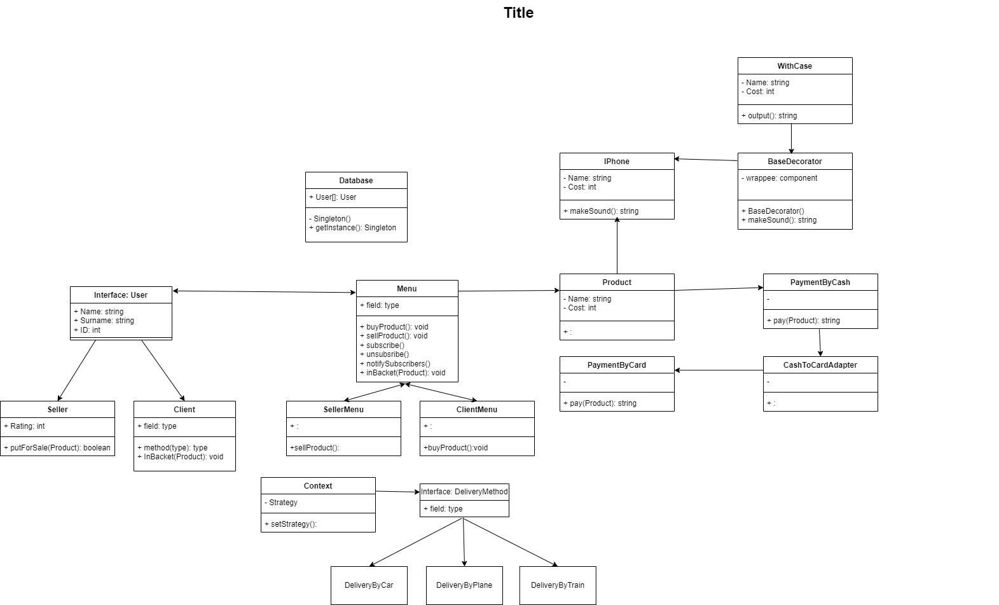

#Project Name: Apple Shop
---
##Group: SE - 2213
---
##Team Members: 
    1.Alikhan Boltekov
    2.Dauren Kambarov
    3.Ilya Khrabrykh
---
##Project Overview
###• Our project is an application for a store (marketplace), where the user can be both a client and a buyer. This platform allows you to buy or sell a product (Apple equipment) depending on who the user is. Moreover, you can select the product, its payment method and delivery method. These options are selected through the menu.

###• The main goal of our project: to create an application accessible to everyone and competitive, which will allow many to purchase or sell the product.

###• The main purpose of our work: Write code for our application correctly and situationally using 6 design patterns, using such principles as SOLID, DRY, and KISS.

###• The objectives of our work: For a team of three people, share the responsibilities for developing the project. I decided to demonstrate the completed part of the work of each of them, combine these ready-made solutions into one project and successfully organize the logic and structure of the application for further operation and execution. Finally, complete the project documentation.
---
##Main Body
###• Explanation:
###• UML-Diagram: 

---
##Conclusion
###• Key points of the project: The application allows you to select a menu for the buyer or seller, allows you to select a product, delivery method and payment method. The project used 6 design patterns and 3 principles. Name of patterns: 1)Singleton 2)Adapter 3)Observer 4)Factory 5)Strategy 6)Decorator. Principles: SOLID, KISS, DRY.
###• Difficulties: The difficulties we encountered were combining the progress of each of us in the project into a single whole application. It was also necessary to study in more detail the syntax of not only the Java programming language, but also the code for writing the readme.md file. As a result: each of the group members improved their understanding of Java programming.
###• Improvements: In the future, we will expand the application catalog, create a graphical interface for the application and add more payment options.